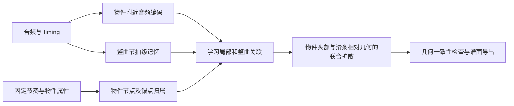

# 音乐条件空间模型：设计与物件级对照

维护者在《晴る》人工谱对照后没有感到新版更满意，决定优化空间模型设计。本轮交付架构设计、可训练的音频条件原型、固定输入的短程实验和测试；**没有完成新空间模型的正式训练，也没有证明可玩性提升**。应用仍使用 coord v0，节奏训练保持停止。

## 已核实的问题

1. coord v0 以时间、类型、距离及难度/CS 为条件，没有直接音频输入。节奏模型换新，不会自动补上空间模型的音乐理解。
2. 旧训练配置的序列长度是 128 个 token，而不是 128 个物件。滑条的锚点、末锚点及结束 token 也占窗口；不同滑条复杂度导致可见物件数不同。推理扩展到更长窗口并不证明模型学到了跨乐句布局。
3. 每个锚点被当作序列元素；模型没有显式的物件归属和“前一物件实际退出位置到下一物件头部”的表示。学习局部坐标不等于学习整段运动编排。
4. 旧扩散实现内部裁剪范围实际为归一化 `[-2,2]`，最后坐标转换又把所有 token 裁剪到场地。控制点与可点击头部的几何含义不同，不能以同一裁剪代替学习。
5. 训练支持距离条件丢弃，因此推理距离置零不应被直接归为错误。问题应通过固定条件的消融检验，而不是猜测。

## 目标架构



整曲记忆的节拍聚合只是计算分辨率，不是乐句边界。模型通过注意力学习远处相似段落的关系；不预先强制每四/八小节换形状，也不强制重复段使用同一图形。需要在包含完整长程上下文的数据上训练，才能评价重复段是否获得改善。

| 层 | 设计 | 本轮状态 |
|---|---|---|
| 局部音频 | 与 token 时间对齐的 16×64 mel patch，经卷积编码 | 已实现 |
| 整曲音频 | 按音频 timing 聚合的节拍 token，经双向编码；跨窗口共享同一记忆和节拍坐标 | 已实现；恒定 BPM 原型 |
| 条件交互 | token 查询融合节奏上下文与连续节拍位置，交叉注意力读取整曲音频 | 已实现 |
| 旧能力复用 | 在原输入嵌入旁加入零初始化残差；首轮冻结旧 DiT，仅训练新分支 | 已实现 |
| 物件级表示 | 每个圆圈/滑条/转盘一个物件节点，锚点通过归属索引连接；记录时长、折返类别、连击和局部 timing | 已实现；完整物件裁剪 |
| 运动与几何 | 联合生成头部绝对位置与滑条相对控制点；以前一物件实际退出位置建立移动关系 | 已实现当前带噪坐标的相对运动条件；独立的头部/相对几何扩散尚未实现 |
| 跨窗空间连续性 | 训练时提供前文空间状态与已知区域掩码，验证与推理的重叠区一致；扩大训练上下文 | 尚未实现 |

复用方式是新增音乐条件残差，不是声称重新设计或重训了整个 DiT。全局记忆目前只有音频信息，**尚不是跨窗口空间布局计划**；物件级条件已实现，但跨窗口空间状态仍未实现。物件级对照未改善验证误差，见[第二轮记录](coordinate-object-audit.md)。

## 软控制、监督和边界

- 使用原谱现成的坐标、曲线、折返和时间监督，不依赖已经停止的主观技能标签路线。
- 节拍相位、间隔、时长和物件归属可以成为输入；目标坐标、真实移动距离及未来真实空间布局不能混入默认推理条件。显式用户距离控制应单独评估。
- 保留绝对头部位置，避免只累积相对位移造成漂移；相对出口移动和滑条局部形状用作结构表示/辅助监督。按物件归一化几何损失，避免控制点多的滑条支配目标；具体权重通过验证集消融确定。
- 不把直线平滑、固定转角、固定串长、固定跳跃距离写成审美规则。跳跃、回跳和尖角可能是刻意编排，需要保持分布多样性。
- 文件字段有效、数值有限、折返时长和路径长度一致等是明确约束。可点击头部的支持范围与控制点支持范围分开；控制点越界本身不能等同于损坏谱面。记录投影前后移动量，避免把大量修正后的结果称为模型自然学会了边界。
- 初期保留现有扩散目标和采样器，单独验证条件与表示。换成 flow matching 或更大骨干不能代替这轮归因。

## 可运行原型与验证

实现：[音频条件模块](../autoosu/ml/coord_context.py)、[短程实验入口](../scripts/coord_context_pilot.py)、[测试](../tests/test_coord_context.py)。Adapter 检查基座 SHA-256，保存格式明确标为 prototype，不供当前 GUI 直接加载。当前 Pilot 使用无 padding、最多 128 token 的完整物件片段，没有把旧 DiT 尚未落实的 padding-mask 参数当作有效支持。

零初始化残差的工程思路参考 [ControlNet](https://arxiv.org/abs/2302.05543)；音乐与运动的长程条件设计参考 [LongDanceDiff](https://arxiv.org/abs/2308.11945)。这些论文不构成 osu! 谱面质量证据。

首轮以旧 coord v0 为固定基座，用两首开发歌训练，两首不同音源的开发歌验证；每首四个 128-token 片段，验证覆盖噪声时刻 100/500/900，共 24 次固定去噪评估。两个方案各训练 64 步，学习率 0.0002，目标坐标只作为训练/验证目标，输入距离统一为零。基座历史训练是否见过这些歌未排除，因此不是独立泛化测试。完整身份、参数及结果见[实验报告](coordinate-v1-pilot-20261008.json)。

| 方案 | 新增可训练参数 | 固定验证噪声 MSE，越低越好 |
|---|---:|---:|
| 冻结 coord v0 | 0 | 0.144963 |
| 局部音频残差 | 400,576 | 0.145153 |
| 局部＋整曲音频残差 | 871,488 | 0.145272 |

两个新分支都没有超过旧模型。打乱音频时间后也没有稳定变差，不能说它们已经学到有用的音乐—空间关系。64 步只验证可训练性和管线，不足以选出质量更好的架构；不要用训练 loss 不同噪声时刻之间的下降证明收敛。

新增测试覆盖：真实非零旧网络输出的初始化等价性、条件分支梯度、旧参数不变、远处音频依赖、裁剪后仍保持同一音频时间轴，以及 adapter 保存/恢复与错误基座拒绝。全套测试 206 项通过。

两个方案还分别在真实验证片段上完成了 100 步纯噪声坐标采样，均输出有限的 `1×2×128` 坐标。局部方案有 3 个原始 token 越出场地、其中头部 0 个；整曲方案有 5 个原始 token 越出场地、其中头部 1 个。未把这些值静默裁掉以隐藏问题；这只是原始坐标采样检查，没有滑条几何贴合、`.osu` 导出或客户端试玩。早期 `pilot-v2` 验证器误把扩散内部范围当成 `[-1,1]` 而失败，已核对源码并在最终 `pilot-v3` 如实记录投影前范围；旧记录保留。

复现时使用包含 `name/split/audio/map/audio_sha256/map_sha256` 的冻结 JSON 源清单：

```powershell
python scripts/coord_context_pilot.py --recipe <sources.json> --base <coord_v0.pt> --out <new-output-directory> --steps 64
```

需要项目 `train` 依赖及用于独立星级测量的 `rosu-pp-py`；权重、歌曲与坐标输出留在 Git 外。本次原始结果在 `out/coord-context-20261008/pilot-v3`。

## 下一阶段的选择门槛

1. 物件归属、实际退出位置、完整物件裁剪已完成；仍需独立的相对滑条几何输出、变速 timing 和源音频偏移支持。当前遇到无法表示的对象直接报错，不静默转成圆圈。
2. 在歌曲分组的训练/验证/测试集上比较旧模型、局部音频、局部＋整曲、再加物件级表示；采用匹配预算、多随机种子。扩大 128/256/512-token 上下文，并区分完整物件与截断物件。
3. 固定同一节奏、CS/AR/OD、随机种子和采样预算，比较空间输出；人工节奏条件与模型生成节奏条件分开报告。星级接近不等于几何质量接近。
4. 同时评估去噪误差、出口到下一头的移动分布、滑条几何修复量、重复段统计、多样性和盲测偏好。不能因为某个指标变好就消灭复杂图形或长距离移动。
5. 新坐标权重达到这些门槛后，再做导出解析、客户端试玩和发布验收。当前不扩大正式训练、不替换默认权重。

## 第二轮结论与重设计方向

256 步、两个种子、六首训练歌的对照仍未超过基座；固定训练集探针改善而验证退化，符合小样本过拟合的表现。暂不扩大冻结输入残差方案。下一步采用“音乐与节奏 → 可学习的物件运动计划 → 坐标几何”的分层假设，先比较真实计划上界、预测计划和联合微调；协议和结果见[物件级审计](coordinate-object-audit.md)。这仍是待验证设计，不能据此承诺质量提升。
