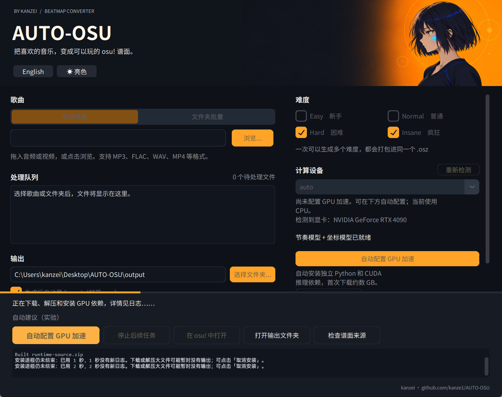
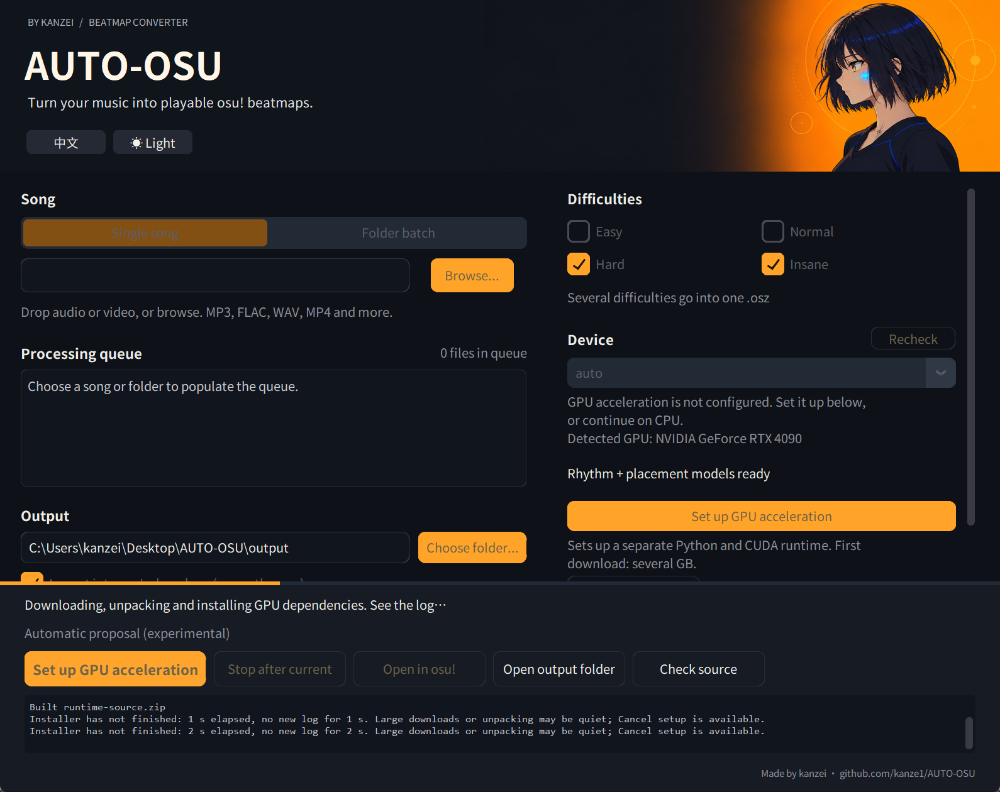

# Runtime setup waiting after `Built runtime-source.zip`

Validated on 2026-10-04 against the `0.3.0rc2` source, starting from `1a1c24f`. This is source validation, not a newly published Windows executable.

## Diagnosis and change

`Built ...runtime-source.zip` is uv reporting that the app's wheel has been built. Other packages can still be downloading concurrently. The piped GUI log has package start/completion events but no terminal download bar; a large PyTorch download can therefore leave `Built` as the last line for a long time. This was reproduced with both a controlled slow download and a real GPU runtime installation.

The previous subprocess loop also had no overall deadline, and switched to an uncancellable `proc.wait()` after output EOF. A subprocess that closed its output without exiting could leave setup waiting indefinitely.

The fix:

- Explains the source-build message before dependency installation, in Chinese and English.
- Emits an elapsed/waiting notice every 15 seconds without new installer logs. It reports that the installer has not exited; it does not claim bytes are being transferred or invent a percentage.
- Applies a one-hour wall-clock deadline to each Python-environment/dependency-install command, including quiet downloads. A healthy but very slow command can reach this limit too.
- Keeps cancellation and the deadline active after output EOF, bounds Windows process-tree cleanup, and terminates the installer process group on POSIX.
- Keeps the real error output and preserves the previous active runtime on cancellation, timeout or failed verification.

uv's package-start/completion messages also appeared before this fix. Changing `UV_NO_PROGRESS` alone did not solve the quiet interval; terminal progress remains disabled. See [uv's progress setting](https://docs.astral.sh/uv/reference/environment/#uv_no_progress).

## Regression and installation evidence

The tracked [runtime tests](../tests/test_runtime.py) cover quiet subprocesses, normal output draining, cancellation before spawning, cancellation/timeouts with stdout open or closed, original error diagnostics, and active-manifest preservation.

Final local checks:

```powershell
.\.venv-gpu\Scripts\python.exe -m pytest -q
python scripts/check_repository.py
git diff --check
```

The complete suite passed: **172 tests**, Python 3.12.8 on Windows. An initial run using the unrelated base Conda interpreter failed because that interpreter lacked `mutagen`; the complete project environment above passed without adding packages to the base interpreter.

### Controlled slow download

Used real uv `0.12.17` with a non-editable `runtime-source.zip` plus a generated 2 MiB test wheel, served over loopback HTTP in 64 KiB chunks every 0.6 seconds. Installation targeted a fresh directory under ignored `build/`, with `--no-deps`. The server supported HEAD/GET but not range requests, so uv fetched metadata and then downloaded the wheel. No songs, models or external test data were used.

| Event | Original runner | Fixed runner |
| --- | --- | --- |
| Source wheel built | 22.1 s | 21.8 s |
| Waiting notice after build | None | 36.8 s, reporting 15 s without new output |
| Test wheel downloaded | 38.6 s | 38.5 s |
| Installation completed | 38.6 s | 38.6 s |

This reproduces the misleading pause and shows the added feedback. It does not claim a faster download.

### Actual GPU runtime installation

Used a fresh app-owned environment under ignored `build/`, an actual non-editable source bundle, the installed uv `0.12.17`, and an existing managed Python `3.12.14`. Only uv/interpreter discovery and the bundle location were supplied by the smoke harness; environment creation, dependency installation, CUDA probing and manifest activation ran through `install_runtime`.

- Hardware: RTX 4090, NVIDIA driver `610.47`.
- The first run downloaded `torch 2.14.1+cu132` (reported as **1.9 GiB**) and installed 39 packages. `Built` appeared at 6.7 s; the torch download finished at 109.1 s. Waiting notices continued during that interval. Setup and a real CUDA tensor calculation completed in 127.0 s.
- A final-code rerun into another fresh environment reused cached packages and completed in 15.4 s. Its non-editable bundle SHA-256 was `1cbf568e16e4bde6df5bca8beafea44818aeca69ab27a3464bc4ea171ad6e4aa`.
- `probe_python` imported the worker and verified a CUDA tensor operation with PyTorch `2.14.1+cu132` / CUDA `13.2`. Only then did the scratch runtime receive `active.json`.
- The existing runtime's `active.json` was compared byte-for-byte and remained unchanged.

The bundle hash identifies the tested input; the successful subprocess, CUDA calculation and manifest assertions provide the execution evidence. Dependencies were resolved live, so these versions/timings describe this run rather than a promised installation result on another machine.

## GUI check and limits

The source GUI was exercised in both languages using a controlled quiet subprocess routed through the real log/progress queue and `run_logged`. The waiting text rendered, the cancel control invoked the real handler, and the GUI returned to its cancelled state. The screenshot harness shortened the heartbeat interval to one second; the shipping default is 15 seconds. The English harness initially checked cancellation after only 1.5 seconds; allowing the bounded cleanup to finish verified the cancelled state at 1.6 seconds.





The reporting user's full logs and machine were not available, so their particular network/disk cause is not established. The frozen executable was not rebuilt or released, and no model inference, generated-map parsing or osu! playtesting was claimed for this installer-only change.
