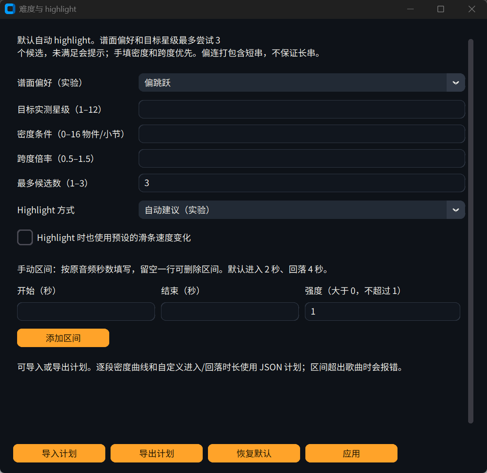
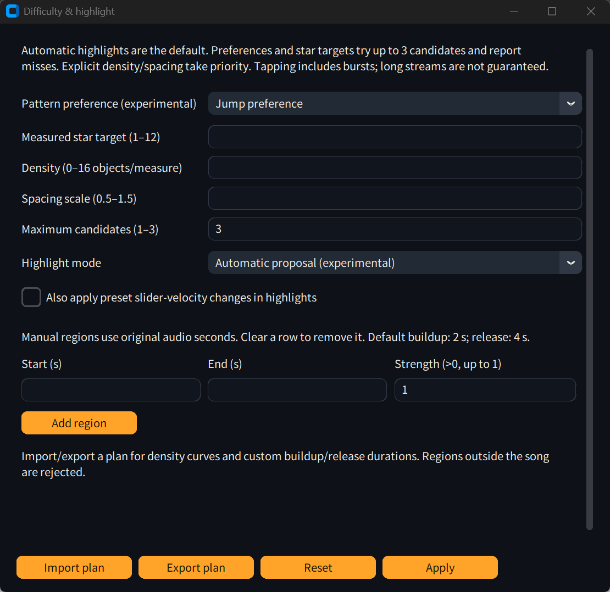

# 条件版谱面偏好与验收

0.3.0rc2 增加 **综合（默认） / 偏跳跃 / 偏连打、短串**，仍使用原来的 v0 权重。CLI、GUI、独立 worker 和文件夹批量共用同一控制字段。自动 highlight 保持默认，用户仍可选择手动、关闭或原有 kiai。**这是实验条件控制，带技能标签的新模型尚未训练。** 重训已排入 [M1.1–M1.4](model-training-plan.md)。



<details>
<summary>English controls</summary>



</details>

## 使用与实际行为

高级选项 → 难度与 highlight 控制 → 谱面偏好。CLI：

```powershell
python -m autoosu "song.mp3" -d Insane --skill-preference jumps
python -m autoosu "song.mp3" -d Insane --skill-preference streams --target-star 6.5
```

JSON 计划字段为 `skill_preference: balanced | jumps | streams`。旧计划缺少该字段时使用综合。手工密度、密度曲线与跨度优先；偏好需要两个模型和至少 2 个候选，最大仍为 3 个。默认综合的生成路径保留原行为。

候选 0 是同歌、同种子的综合参考。偏跳跃默认复制该参考的节奏，使用 1.20 倍物件头进入距离；偏连打按参考实际节奏恢复局部密度，使用训练口径的前后 8 小节平滑后乘 1.50，跨度默认 0.80。参考已经包含 highlight 密度变化，因此不重复放大。用户手填密度时使用用户条件重新生成节奏。

后续候选根据实测星级修正模型星级条件。筛选先检查结构与局部 strain，再检查以下相对参考的变化：

- 跳跃：圈到圈间隔在 0.375–1.25 拍、距离至少 4 个圈半径的转移比例增加至少 5 个百分点；或者已有至少 8 次跳跃，比例减少不超过 1 个百分点，同时中位间距增加至少 15% 且至少 16 像素。
- 连打：连续至少 5 个四分之一拍圆圈构成的物件比例增加至少 5 个百分点。滑条、转盘和节奏断点会打断序列；这里包含短串，不能等同于长串标签。
- 候选实际星级须在参考 ±0.5★ 内；填写目标时还须在目标 ±0.5★ 内。仅靠变难不能算偏好生效。

没有匹配候选时显示“本次未满足偏好”。未填目标且参考合格时回退参考；填写目标时优先保留合格候选中更接近目标的一张。若所有候选都不合格，保留原有 `fallback_unverified` 状态和警告，不把它当成验收通过。参考星级离目标较远时，目标接近与偏好匹配可能无法同时成立。

这些是局部模式指标，不是人工技能标签或自然度评判。候选指标、选中原因、实际节奏 / 坐标星级条件、密度来源和偏好结果写入原有 evaluation 报告；GUI 结果显示对应中文 / 英文提示。

## 冻结实测

使用原来的 4 首熟悉歌曲开发条件，第一次直接降低跳跃密度的方案响应较差，随后改成保留节奏。最终条件在开发歌曲上冻结后，使用 **8 首新的音频分组**验收，各生成综合、跳跃和连打，并分别运行参考 timing / 自动 timing。两种 timing 用的是同一批歌，不能计为 16 首独立歌曲。

新组排除了既有 Q1 曲集与 D1 曲集的音频哈希。没有完成同曲不同编码 / 近重复审计，也不能证明与 v0 训练语料无交叠，因此只称为**未参与本轮条件调参的预留歌曲**。另准备的 2 首开发分组未用于调参或验收。

固定配置：seed `240924`，Insane，模型星级条件 `6.5`，rhythm 12 轮、coordinate 100 步，temperature `0.9`、CFG `1.0`，CUDA / RTX 4090，默认自动 highlight；这组筛查未指定目标实际星级。权重、代码、曲集哈希、环境、逐歌结果与全部候选摘要见 [JSON 报告](skill-preferences-evaluation.json)。

| 曲集 / timing | 输出数 | 跳跃满足 | 连打满足 | 结构错误 / 未验证回退 |
| --- | --- | --- | --- | --- |
| 4 首开发歌 / 参考 | 12 | 2/4 | 2/4 | 0 / 0 |
| 8 首预留歌 / 参考 | 24 | 8/8 | 7/8 | 0 / 0 |
| 同 8 首预留歌 / 自动 | 24 | 7/8 | 6/8 | 0 / 0 |

预留输出实际范围约 **4.82–6.37★（参考） / 5.00–6.37★（自动）**，不据此承诺高星偏好控制。自动 timing 下 `11c35b53` 的跳跃、`09965f93` 和 `159e3c7e` 的连打未满足；参考 timing 下 `0c49ccea` 的连打未满足，均按设计回退。4 首熟悉歌曲也仍有未响应样本，不能用预留集较高的比例覆盖这些失败。

## 其他验收

- 162 项自动测试通过，包含参数校验、计划 / CLI 覆盖、连打与跳跃指标、星级和结构筛选、缺模型拒绝及完整导出链。
- 4 首综合输出与先前自动 highlight 对照的 `.osu` **逐字节相同**。
- 60 张实测输出均通过独立 `slider 0.8.2` 解析，物件数一致。参考 timing 中有 3 条滑条带场外锚点，对每条实际中心路径采样 1001 点，未发现越界；这不是精确极值或客户端试玩。
- 60 张实测输出均能在对应的本机生成记录库匹配，来源校验未回退为文件声明。
- 独立 CUDA worker 实际生成单首 Easy / Normal / Hard / Insane 共 4 张跳跃偏好图，以及文件夹内 2 首手动 highlight 连打偏好图；报告、计划和本机来源记录一致。低难度的 2 张未满足偏好，正常显示未满足。
- 真实 GUI 的中英文各检查 3 种偏好 × 4 种 highlight；密度曲线、手动进入时长和跨度保持，导入 / 导出、应用后重新打开通过。上方为实际窗口截图。
- 新偏好的人工作图评价、手动试玩和编辑器另存尚未进行。此前 A/B/C/D 的人工反馈不算本次偏好的人工验收。

## 复现入口

准备合法持有的同一音频 / 参考谱面，使用 JSON 报告中相同的语料分组与环境。[曲集清单](skill-preferences-corpus.json)记录分片、成员名、谱面 ID、哈希、划分及既有样本排除清单，不包含音乐或谱面内容。原始歌曲、模型和生成文件保留在本机 `out/` / `models/`，不进入 Git。`evaluate_difficulty.py prepare` 可从本地语料分片准备同格式曲集。

```powershell
python scripts/evaluate_preferences.py --out out/skill-preferences-reference --corpus out/skill-preferences-corpus --partition heldout --timing reference
python scripts/evaluate_preferences.py --out out/skill-preferences-automatic --corpus out/skill-preferences-corpus --partition heldout --timing automatic
# 独立环境需要 slider 0.8.2；应用环境负责来源与报告检查。
python scripts/report_preferences.py --curves out/skill-preferences-reference out/skill-preferences-automatic
python scripts/report_preferences.py out/skill-preferences-reference out/skill-preferences-automatic --output out/preference-report.json
```

运行脚本冻结核心代码、权重与参数；恢复任务时如果 recipe 不同会拒绝混写。新的条件调参不能继续使用这 8 首作为独立验收集。高难度和 highlight 的未完成工作仍见 [Q2 / H1](generation-control-tasks.md)，不会因加入偏好而视为完成。
